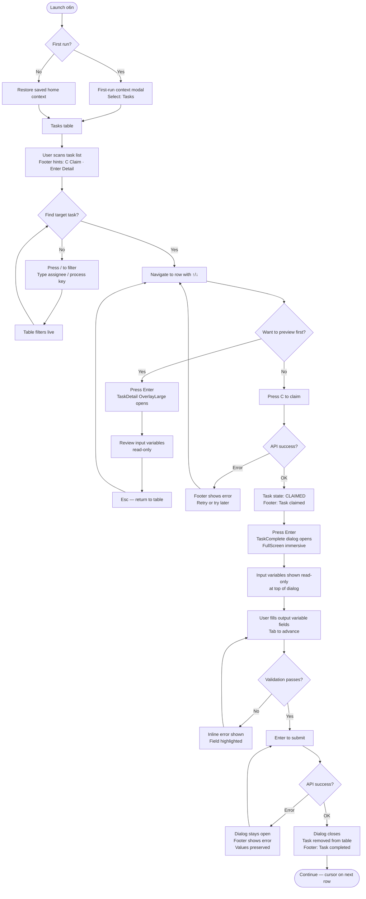
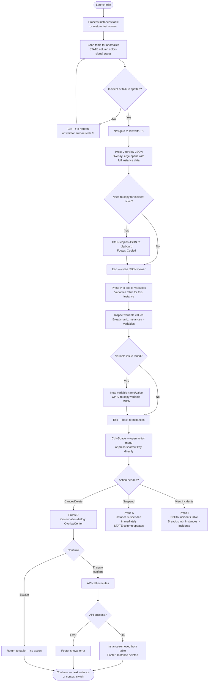
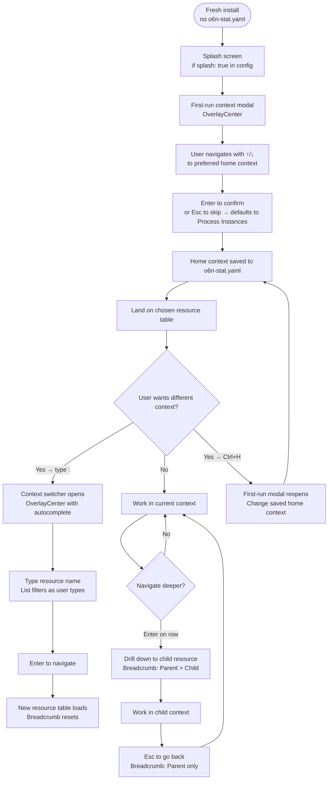
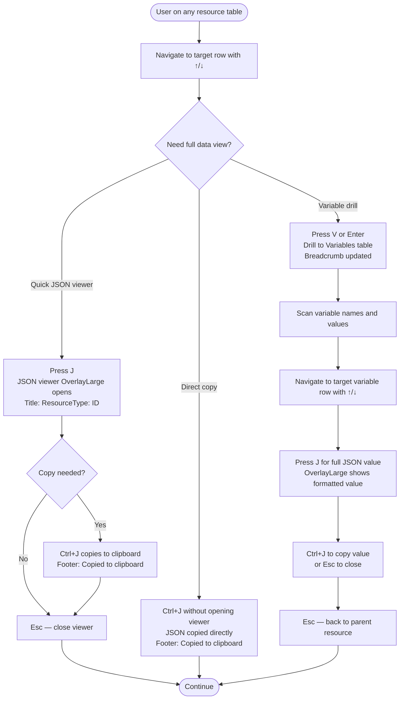

# UX Design Specification — o6n

**Author:** Karsten
**Date:** 2026-03-03

---

<!-- UX design content will be appended sequentially through collaborative workflow steps -->

## Project Understanding

### Executive Summary

o6n is a keyboard-first terminal UI for managing Operaton BPMN workflow engines, inspired by k9s. It gives DevOps engineers and BPMN operators a fast, discoverable interface to navigate process definitions, process instances, tasks, and associated variables — directly from the terminal without leaving their editor or switching to a browser.

The product's core value proposition is speed through keyboard mastery: every operation reachable by keystroke, every resource navigable in seconds, every action executable without mouse. It is a brownfield project with an evolving implementation; the UX design specification codifies patterns that are emerging but not yet fully consistent, and defines the target state for the complete system.

### Target Users

**Alex — DevOps Engineer**
Primary operator. Monitors running process instances, inspects variables, cancels or retries stuck processes. Works in VSCode integrated terminal. Optimizes for speed; learns key bindings quickly. Expects k9s-like muscle memory.

**Priya — BPMN Operator**
Day-to-day task handler. Claims human tasks, reviews input variables, completes tasks with output variables. May work in IntelliJ IDEA terminal. Less familiar with vim conventions; needs discoverable actions and clear confirmation flows.

**Marco — Go Contributor**
Extends the tool. Reads source, adds resource types, modifies config. Cares about config-driven architecture, clean patterns, and consistency of the keyboard grammar across resource types.

### Key Design Challenges

1. **Density within 120×20 viewport.** Every pixel is shared between navigation, data table, breadcrumb, hints, and status. Column visibility, hint priority, and modal sizing must all be width-aware.

2. **Action discoverability without mouse.** There is no right-click, no hover tooltip. Users must discover available actions through footer hints, the action menu, and the help screen — without being overwhelmed at any tier.

3. **State legibility across resource types.** Process instances, tasks, jobs, and incidents each have distinct lifecycle states. Colors and labels must consistently communicate state across 35 resource types without a legend.

4. **Complex dialogs in terminal constraints.** Task completion requires input review, output variable entry with type validation, and confirmation — all inside a modal that must remain smaller than the terminal viewport.

5. **Keyboard convention consistency.** As the feature set grows, key bindings accumulate conflicts and inconsistencies. The grammar (case, modifier use, overloading) must be governed by explicit rules, not per-feature decisions.

### Design Opportunities

1. **Footer-as-HUD.** The hint bar is permanently visible and context-sensitive. Used well, it functions as an always-present ambient guide — not a help page users have to seek out.

2. **Config-driven discoverability.** Because resource definitions and their associated actions live in `o6n-cfg.yaml`, the hint system can surface resource-specific keys at priority 1–2, ahead of global navigation. The config file becomes the UX specification for each resource type.

3. **Progressive disclosure.** Three tiers — footer hints → Ctrl+Space action menu → ? help screen — allow new users to discover gradually without overwhelming experts. Each tier is richer and more comprehensive than the last.

4. **Environment-as-color-signal.** The `env_name` semantic color role, shown in a fixed header position, lets operators running multiple terminals against different environments instantly distinguish them. No text reading required at a glance.

5. **First-run onboarding.** A one-time context selection modal on fresh start can route each user type to their primary resource without requiring config edits. Persisted preference means the second launch is instant.

6. **OverlayLarge contextual modals.** A new intermediate modal size (~80%×80%) preserves background context while presenting rich content (detail view, JSON viewer, help screen). Users retain spatial orientation even when a modal is open.

### Party Mode Design Decisions (Step 2 Discovery)

The following 20 design decisions were surfaced and confirmed during Step 2 Party Mode with Counselor Troi (UX Lead), UX Review, and Mary:

1. **First-run home context selection** — On fresh start (no persisted state), o6n shows a context selection modal reusing the context switcher pattern. The selected resource becomes the home. Choice is persisted to `o6n-stat.yaml`. `Ctrl+H` revisits from any state.

2. **Hint hierarchy inversion** — Resource-specific action keys (from `TableDef.Actions` in config) are assigned hint priority 1–2. Global navigation keys (Esc, Ctrl+Space, /) drop to priority 4+. Most-used resource actions are always visible first.

3. **Environment visibility redesign** — A dedicated `env_name` semantic color role in skins governs the environment label color. The label is fixed top-right in the header. This replaces the current `ui_color` border approach as the primary environment signal.

4. **Remove ui_color border flood** — The `ui_color` accent color is removed from border painting. It is demoted to a secondary signal (e.g., accent elements within focused widgets) to avoid visual noise and false environment cues.

5. **Three-tier discoverability formalized** — Footer hints → Ctrl+Space action menu → ? help screen is established as an explicit architectural system, not an emergent collection of features. Each tier has defined scope and responsibility.

6. **Confirmation principle** — Confirmation dialogs are required for actions that are **both** irreversible **and** have a blast radius beyond a single row (delete, stop job, terminate, batch operations). Single-row reversible actions do not require confirmation.

7. **Splash screen config** — `splash: bool` is an optional field in `o6n-cfg.yaml` (default: show splash). The `--no-splash` CLI flag overrides. Sequencing: splash → first-run prompt (if needed) → main view.

8. **Modal size classification** — Three tiers: `OverlayCenter` (compact dialogs, ~50%×auto), `OverlayLarge` (NEW, ~80%×80%, for rich content), `FullScreen` (immersive flows). All modals declare their size class.

9. **Modal emotional grouping** — Modals are categorized by role: Operational (Edit, Sort, ActionMenu), Consequential (ConfirmDelete, ConfirmQuit), Contextual (Help, DetailView, JSONView), Immersive (TaskComplete). Size class follows category.

10. **ModalHelp reclassified** — From `FullScreen` to `OverlayLarge`. Background context is preserved; users retain spatial awareness of where they invoked help from.

11. **ModalDetailView reclassified** — From `FullScreen` to `OverlayLarge`. Same rationale: detail content is reference, not immersive — background context aids orientation.

12. **ModalJSONView introduced** — New modal type, `OverlayLarge`. Title = resource type + ID. `J` opens it. `Ctrl+J` copies JSON directly to clipboard without opening the viewer. Replaces the `y` copy-as-YAML pattern throughout.

13. **YAML → JSON throughout** — All copy/view operations use JSON. `y` (copy as YAML) is removed. `J` / `Ctrl+J` are the canonical data export keys.

14. **Keyboard case convention** — All keys shown in the help screen are uppercase without indicating Shift. Uppercase in help = no Shift required. Modifier keys (Ctrl, Alt, Shift) are always spelled out explicitly when required. This is a display rule, not an input rule.

15. **Key binding changes** — `Ctrl+Shift+V` = vim toggle, `Ctrl+R` = immediate refresh, `Ctrl+Shift+R` = toggle auto-refresh. `V` alone is freed for future use.

16. **H = view history convention** — `H` navigates to the history view for the current resource type, consistent across all resource types that support history.

17. **Mandatory hint lines for complex modals** — `OverlayLarge` and `FullScreen` modals must render a hint line at their bottom. This is a spec contract, not a nice-to-have. Modal hint lines follow the same `Hint{Key, Label, MinWidth, Priority}` system as the main footer.

18. **Search/filter five visual states** — Explicitly defined: (1) no filter active, (2) filter popup open, (3) filter locked/active, (4) server-side filter applied, (5) filter cleared/resetting. Each state has distinct visual treatment.

19. **Auto-refresh indicator design** — `⟳` symbol in footer right area, rendered in accent color. Flashes briefly on each refresh cycle. Absent entirely when auto-refresh is off. No text label.

20. **API status design** — Three states: `●` (connected, green), `✗` (error, red), `○` (idle/unknown, muted). Always rendered as color + symbol; never color alone (colorblind accessibility).

## Core User Experience

### Defining Experience

The defining o6n interaction is: **navigate to any resource, inspect it, and act on it — without leaving the keyboard.** Every session begins with the user arriving at a resource table (process instances, tasks, or wherever they persisted from last time), scanning rows, and taking a targeted action. The speed between "I need to see X" and "I'm looking at X" is the product's primary value.

For Alex (DevOps), the core loop is: filter instances → inspect → kill or retry. For Priya (BPMN Operator), it is: find task → claim → review inputs → complete with outputs. Both loops share the same keyboard grammar — the product succeeds when both feel native.

### Platform Strategy

- **Terminal/TUI only.** No web, no mobile, no desktop GUI. Constraints are permanent and architectural.
- **Keyboard-exclusive interaction.** Mouse input is unsupported by design. Every action reachable by keystroke.
- **Primary target:** Linux and macOS native terminals (gnome-terminal, iTerm2, Terminal.app, Alacritty). Minimum viewport 120×20.
- **Secondary target:** VSCode integrated terminal (for development workflows). IntelliJ IDEA terminal.
- **No offline mode.** o6n is a live API client; network connectivity to an Operaton engine is a hard prerequisite.
- **Static binary.** No runtime dependencies; distributes as a single file per platform.

### Effortless Interactions

These interactions must require zero conscious effort for experienced users:

1. **Context switching** — `:` opens the context switcher; typing a resource name and pressing Enter jumps there instantly. Muscle memory from k9s users transfers directly.
2. **Drill-down navigation** — Enter on a table row descends into the child resource. Esc ascends. No menus, no confirmation, no loading spinners blocking the keyboard.
3. **Filter/search** — `/` enters filter mode immediately. The table filters as the user types. Esc clears and exits.
4. **Action discovery** — Ctrl+Space opens the action menu from any table row. All available actions for the current resource are listed; no memory required.
5. **Variable copying** — `J` or `Ctrl+J` on any variable or resource row immediately surfaces the JSON value. No multi-step flow.

### Critical Success Moments

1. **First successful task completion.** Priya claims a task, reviews input variables, fills in output variables with type validation, confirms, and sees the task disappear from the list. If this flow is confusing at any point, the product fails for its most consequential use case.
2. **First context switch.** Alex types `:incidents` and lands on the incidents table in under 2 seconds. This moment establishes that the keyboard grammar works and learning it pays off.
3. **First drill-down.** A new user presses Enter on a process instance row and arrives at the variables view with breadcrumb showing the path. They press Esc and return. Spatial model established.
4. **First environment distinction.** A user opens o6n against a production environment and immediately sees the distinct env color in the header — before reading any text. Environment misidentification prevention.
5. **First hint-driven discovery.** A user sees a hint in the footer, presses the key, and the action executes. The hint system proves its value in a single interaction.

### Experience Principles

1. **Keyboard fluency compounds.** Every interaction is designed for users who will repeat it hundreds of times. Optimize for the 100th use, not the first — but use progressive disclosure to get users to their 100th use safely.
2. **Context is never lost.** Navigation always shows breadcrumb. Modals preserve background. Esc always goes back. Users always know where they are and how they got there.
3. **The config is the UX.** Resource actions, column visibility, drilldown rules, and hint priorities are defined in `o6n-cfg.yaml`. The tool's behavior is inspectable, not magic — contributors extend the UX by editing config.
4. **Color signals are semantic, not decorative.** Every color use carries a defined meaning (environment identity, resource state, action category, error/warning). Color is never used purely for aesthetics.
5. **Trust the keyboard grammar.** A consistent, learnable grammar of keys (resource-specific at 1–2, global nav at 4+, modifiers explicit, case normalized) means users can guess correctly. Correctness of guesses is a design metric.

## Desired Emotional Response

### Primary Emotional Goals

o6n users should feel **in command** — the same focused, efficient feeling a vim or k9s expert has when their muscle memory fires correctly. The primary emotional goal is **controlled competence**: the sense that the tool amplifies your ability rather than placing friction between you and the engine.

The secondary feeling is **calm confidence** in high-stakes situations. When an operator is diagnosing a stuck process instance or completing a task under production pressure, the UI must not add anxiety. Clear state, predictable keys, explicit confirmations for destructive actions — the tool stays out of the way emotionally.

### Emotional Journey Mapping

| Moment | Target Emotion | Anti-pattern to Avoid |
|---|---|---|
| First launch | Curious, oriented | Overwhelmed, lost |
| First hint discovery | "Oh, I can do that" | Ignored, invisible |
| First drill-down | Spatially grounded | Disoriented ("where am I?") |
| First task claim + complete | Accomplished | Anxious about mistakes |
| Repeated daily use | Fluent, fast | Bored or impatient with friction |
| Error or API failure | Informed, not alarmed | Confused, panicked |
| Destructive action prompt | Deliberately cautious | Surprised, regretful |

### Micro-Emotions

- **Confidence over confusion** — keyboard grammar predictability. When a key binding makes sense, users feel smart, not lucky.
- **Accomplishment over frustration** — task completion is the most emotionally loaded flow. Success must feel clean and final.
- **Trust over skepticism** — API status, pagination counts, and stale-data indicators must be honest. Users need to trust what they see.
- **Calm over anxiety** — confirmation dialogs for destructive actions provide a deliberate pause, not bureaucratic friction.
- **Delight (rare, earned)** — the `⟳` flash on auto-refresh, the environment color lock, the action menu appearing exactly when needed. Small moments of "this tool thinks like I do."

### Design Implications

- **Confidence** → Consistent keyboard grammar with explicit case and modifier rules. No surprising rebindings. Hint system that teaches rather than clutters.
- **Controlled competence** → Progressive disclosure tiers (footer → action menu → help) mean users gain power incrementally, never all-at-once overwhelm.
- **Calm confidence** → Confirmation dialogs only where the blast radius warrants it. No confirmation theater for low-stakes actions.
- **Spatial grounding** → Breadcrumb in footer always present. Modals preserve background context (OverlayLarge, not FullScreen). Esc always reverses.
- **Trust** → API status indicator always visible (color + symbol). Pagination shows total count. Auto-refresh indicator is honest about when data was last fetched.
- **Accomplished** → Task completion modal has a clear, positive terminal state. The task disappears from the list. No ambiguity about whether it worked.

### Emotional Design Principles

1. **Never surprise with consequences.** Destructive actions require deliberate confirmation. Reversible actions don't — friction must be proportionate to risk.
2. **Reward keyboard investment.** The first time a learned key binding fires correctly, the user should feel the payoff. Hint → action execution must be a satisfying one-keystroke loop.
3. **The error is not the end.** API errors display in the footer with auto-clear. They inform without blocking. The user can continue navigating immediately.
4. **Silence is honest.** If there's no data, show a clear empty state. If the API is unreachable, show the status indicator. Never show stale data silently.
5. **Familiarity lowers anxiety.** k9s and vim users arrive with existing mental models. Adopting their conventions (`:` for context, `Esc` to back out, `/` for search) reduces onboarding anxiety before the first keystroke.

## UX Pattern Analysis & Inspiration

### Inspiring Products Analysis

**k9s** (primary inspiration)
k9s is the direct archetype for o6n. Its core UX achievements: `:` context switching with autocomplete gives instant resource type navigation; table views with configurable columns scale from 80-col terminals to wide displays; drilldown with Esc-to-back creates spatial navigation without page reloads; `/` live filter works on the current in-memory dataset. Crucially, k9s's footer hint bar — showing available keys contextually — teaches users without a separate tutorial. The combination of discoverable keys + muscle memory payoff is what o6n directly adopts.

**vim**
vim's contribution to o6n is the keyboard grammar philosophy: every key is a verb, modifier, or object; the grammar is learnable rather than arbitrary; modes separate navigation from action. o6n doesn't implement full modal editing, but it borrows: `j/k` row navigation, `g/G` for top/bottom, `/` for search, and the vim mode toggle itself. The key insight from vim is that apparent complexity dissolves when the grammar becomes fluent — the investment pays dividends.

**htop**
htop demonstrates how to make a dense information display readable in a terminal. Its function key row at the bottom (F1–F10 with labels) is the ancestor of the hint bar pattern. It shows that an "always-visible legend" doesn't need to be a help screen — it can be part of the chrome. htop also demonstrates color as state signal: red/yellow/green process states read instantly without text labels.

**Midnight Commander**
MC's Space bar for selection (which informed the decision to reserve Space for future multi-row selection, with Ctrl+Space for the action menu) is a direct reference point. MC shows that TUI users have strong muscle memory from file managers that should not be violated.

### Transferable UX Patterns

**Navigation Patterns**
- **`:` + autocomplete for context switching** (from k9s) — direct adoption. Lets users jump between 35 resource types without knowing exact names.
- **Breadcrumb trail in footer** (adapted for TUI) — always shows current path; users never need to ask "where am I."
- **Esc as universal back** (from k9s + browser) — no exceptions. Esc always moves toward home. Never assigned to a destructive action.
- **Stack-based navigation** (from k9s `navigationStack`) — Esc pops the stack; Enter pushes. Drill-down is spatial, not modal.

**Interaction Patterns**
- **Footer hint bar as ambient guide** (from k9s + htop) — always-present, context-sensitive, width-aware. The most important pattern in o6n's discoverability system.
- **Live filter on `/`** (from k9s + vim) — instant feedback, no submit step, Esc to clear.
- **Progressive disclosure tiers** — footer hints → action menu → help screen. Power users stay in tier 1; new users use tier 3.
- **Double-confirm for destructive actions** (from k9s) — first keypress shows confirmation; second executes. Prevents accidental operations.

**Visual Patterns**
- **Color as primary state signal** (from htop, k9s) — resource states read by color before text. Color + label, never color alone, for accessibility.
- **Column auto-hide at narrow widths** (from k9s) — lower-priority columns disappear below threshold widths, preserving readability.
- **Fixed-position status elements** (from system monitors, tmux) — environment name top-right, API status adjacent. Anchors users glance at, not read.
- **Modal overlay preserving context** (from IDE quick-open, fzf overlays) — bordered modal with background visible. Prevents "where was I?" on dismiss.

### Anti-Patterns to Avoid

- **Undiscoverable actions behind unlisted keys** — any action not reachable from the hint bar or action menu is invisible to users. Every key with a function must appear in at least one discovery tier.
- **Confirmation theater** — confirmation dialogs for low-stakes, reversible actions create fatigue and train users to dismiss without reading. Reserve for genuine blast-radius risk.
- **Color as sole differentiator** — relying on red/green without symbols or labels excludes colorblind users and breaks in monochrome terminals.
- **FullScreen modals for reference content** — opening a full-screen modal for help or detail view destroys spatial context.
- **Inconsistent key behavior across resource types** — if `D` deletes on one resource type but does something else on another, trust breaks. The grammar must hold universally.
- **Silent stale data** — showing cached data without indicating staleness creates wrong operational decisions.
- **Overloaded single keys** — a key that does different things depending on subtle context state is a trap. Prefer explicit mode indicators or separate keys.

### Design Inspiration Strategy

**Adopt directly:**
- k9s `:` context switching with autocomplete
- k9s/htop footer hint bar, width-aware and context-sensitive
- k9s Esc-as-back stack navigation
- htop/k9s color-as-state-signal with consistent palette per state category
- vim `/` live filter with Esc-to-clear

**Adapt for o6n's specifics:**
- k9s double-confirm → o6n confirmation principle (irreversible + blast radius, not just destructive category)
- htop F-key legend → o6n `Hint{Key, Label, Priority}` system with dynamic priority based on resource type
- fzf overlay → o6n OverlayLarge modal class (~80%×80%) to preserve background context
- k9s full-screen resource detail → o6n OverlayLarge detail view (background preserved)

**Avoid bringing in:**
- MC Space-for-action (conflicts with planned multi-row selection; reserved → Ctrl+Space instead)
- vim full modal editing complexity (vim mode is optional and limited; o6n is not a text editor)
- htop's function key row (terminal F-key conflicts; o6n uses alphabetic keys + modifiers)
- Any GUI-derived hover/tooltip pattern (unsupported in TUI; replaced by hint bar)

## Design System Foundation

### Design System Choice

o6n uses a **custom TUI design system** built on the Charmbracelet ecosystem (Lipgloss + Bubbles). The stack is established and in active use. The design system decision here concerns how the existing stack is governed, extended, and made consistent.

The three-layer structure:
1. **Lipgloss** — low-level styling primitives: colors, borders, padding, alignment. Renders ANSI escape sequences.
2. **Bubbles** — high-level reusable components: table, viewport, textinput, spinner. Provides interaction behavior.
3. **o6n Skin System** — 36 built-in color themes as YAML files in `skins/`. The brand/environment expression layer. Runtime-switchable. `ui_color` in `o6n-env.yaml` sets the per-environment accent.

### Rationale for Selection

- **Stack is established.** Lipgloss + Bubbles is the de facto standard for Go TUI development. Governing it is the task, not replacing it.
- **Custom over off-the-shelf.** No TUI equivalent of Material Design exists at this maturity level.
- **Config-driven extension.** New resource types and their visual representation are added through `o6n-cfg.yaml`, not code.
- **Skin system provides brand + environment expression.** All semantic color roles are resolved at runtime from the active skin, enabling the environment-color-signal pattern and user theming.

### Implementation Approach

**Semantic color roles** (defined in skin YAML, resolved at render time):
- `primary` — default text
- `secondary` — muted/secondary text
- `accent` — interactive highlights, selection
- `env_name` — environment label color (NEW)
- `error` / `warning` / `success` — status states
- State-specific roles per resource category (active/suspended/completed/failed/incident)

**Component inventory** (existing + planned):
- `Table` — sortable, filterable, width-aware column visibility, configurable per `TableDef`
- `Modal` — factory pattern with three size classes: `OverlayCenter`, `OverlayLarge` (NEW), `FullScreen`
- `Footer` — hint push model with `Hint{Key, Label, MinWidth, Priority}`; includes breadcrumb, API status, auto-refresh indicator
- `Header` — resource title, environment label (fixed top-right), pagination info
- `ActionMenu` — Ctrl+Space overlay listing resource-specific + global actions
- `ContextSwitcher` — `:` overlay with autocomplete over all resource types
- `JSONView` — OverlayLarge modal for formatted JSON display + clipboard copy (NEW)
- `TaskCompleteDialog` — FullScreen immersive flow for human task completion

**Modal hint lines** — all OverlayLarge and FullScreen modals render a bottom hint line using the same `Hint` system as the main footer. This is a design system contract.

### Customization Strategy

- **New skins:** Add a YAML file to `skins/`. Must define all required semantic color roles.
- **New resource types:** Add a `TableDef` entry to `o6n-cfg.yaml`. Columns, actions, drilldown targets, and hint priorities are all config-driven.
- **New modal types:** Use the Modal factory (`renderModal(ModalConfig{Size: OverlayLarge, ...})`). Declare size class, title, and hint line. No layout arithmetic in calling code.
- **New key bindings:** Added to the resource's `Actions` list in config for resource-specific keys. Global keys are governed by the keyboard grammar spec.

## Defining Experience

### Core Defining Experience

**o6n's defining experience: "Jump to any resource, act on it, move on — without lifting your hands from the keyboard."**

A DevOps engineer types `:processInstances`, filters for the stuck job, presses a key to cancel it, and is back to their editor in 15 seconds. A task operator sees their queue, claims the next item, fills in the outputs, and moves on. No browser tabs, no mouse, no context switch.

The most consequential defining experience is **the human task completion flow.** The tool knows the task's input variables, presents them for review, validates the output variable types, and submits in one structured flow. When a user completes a task in o6n, they know they got it right.

### User Mental Model

**Current solutions users come from:**
- Swagger UI / REST clients — stateless, manual, no task context, error-prone variable entry
- Operaton Tasklist web UI — browser-dependent, mouse-driven, requires switching out of terminal workflow
- curl scripts — powerful but non-interactive; no variable preview; no type validation

**Mental model users bring:**
- k9s / kubectl users: `:resource`, table, Enter to drill, Esc to back, `/` to filter — transfers directly
- vim users: modal-like awareness, `/` for search — the optional vim mode reinforces this
- Midnight Commander users: Space for row selection — key conflict avoided; Space reserved for future multi-row selection

**Where users get confused in similar tools:**
- "What does this key do here?" — solved by hint bar and action menu
- "Did that action execute or not?" — solved by immediate visual feedback and footer messages
- "Am I looking at stale data?" — solved by auto-refresh indicator and explicit refresh key
- "Did I just delete the wrong instance?" — solved by the confirmation principle (blast-radius gating)

### Success Criteria

1. **Navigation is sub-second.** `:` → type → Enter lands on the target resource table in under 1 second.
2. **The right action is always discoverable.** A first-time user finds available actions for the current row within 10 seconds via footer hints → Ctrl+Space.
3. **Task completion has zero ambiguity.** After completing a human task, the task is gone from the list and the footer confirms success.
4. **Destructive mistakes are prevented, not just warned about.** Confirmation flow requires deliberate two-step input, not just "press Y."
5. **Environment confusion is impossible at a glance.** The `env_name` color in the header is distinct enough that prod and staging terminals are never misidentified.

### Novel vs. Established Patterns

**Established (direct adoption):**
- `j/k` or arrow key table navigation — zero learning required
- `/` live filter — established from vim, k9s, fzf
- Esc-to-back stack navigation — universal from browsers, k9s
- `:resource` context switching — direct from k9s

**Combination of familiar patterns (o6n synthesis):**
- Config-driven hint priority system — teaches itself through existing footer chrome
- Three-tier discoverability (footer → action menu → help) — intentional hierarchy is novel; each tier is individually familiar
- OverlayLarge modal class — familiar as IDE quick-open overlay, new in TUI context

**Novel (requiring education):**
- First-run home context selection — framed as a "where do you want to start?" modal; self-explanatory
- Environment-as-color-signal (fixed top-right `env_name`) — familiar from web environment banners; self-explanatory from first view
- `Ctrl+Space` for action menu — taught via hint bar on first load and documented in help

### Experience Mechanics

**Primary flow: find a task and complete it**

1. **Initiation:** User arrives at tasks table. Footer shows resource-specific hints at priority 1–2: `C Claim`, `Enter Detail`, `Ctrl+Space Actions`.

2. **Interaction:** User presses `/`, types a filter, finds the target task. Presses `C` to claim. Footer confirms claim. Task state updates in the table. User presses Enter to open the TaskComplete dialog (FullScreen, immersive).

3. **In dialog:** Input variables shown read-only at top. Output variable fields rendered with type-appropriate inputs and inline validation. Hint line at bottom: `Tab Next field`, `Enter Submit`, `Esc Cancel`.

4. **Feedback:** On Tab, validation runs inline. On Enter, API call executes. Success: dialog closes, footer shows "Task completed", task row disappears.

5. **Completion:** User is back at the tasks table, cursor on the next row. Zero navigation required to continue.

**Error path:** If the API call fails, the dialog stays open. Footer in the dialog shows the error. User can retry or Esc to cancel without losing entered values.

## Visual Design Foundation

### Color System

o6n uses a multi-theme skin system (36+ built-in skins). The visual foundation defines the **semantic color role system** that all skins must implement — not a specific palette.

**Semantic color roles (skin contract):**

| Role | Purpose | Notes |
|---|---|---|
| `primary` | Default table text | High contrast against background |
| `secondary` | Muted/auxiliary text | Pagination, timestamps, secondary columns |
| `accent` | Selected row, focused widget borders | Active state; environment-independent |
| `env_name` | Environment label in header | Set per-env in `o6n-env.yaml`; the environment identity signal |
| `header_bg` | Header bar background | Separates chrome from content area |
| `border` | Widget borders | Neutral by default; demoted from `ui_color` |
| `success` | Active/running/completed states | Green family |
| `warning` | Suspended/incident/attention states | Yellow/amber family |
| `error` | Failed/terminated/error states | Red family |
| `muted` | Empty states, placeholders, disabled | Low contrast, never actionable |
| `hint_key` | Hint bar key labels | Distinct from hint label text |
| `hint_label` | Hint bar description text | Secondary weight |

**ANSI constraints:** All colors must render correctly in 256-color and truecolor terminals. Dark background is the primary target; light background skins are secondary.

**State color conventions (consistent across all resource types):**
- `ACTIVE` / `RUNNING` → success color
- `SUSPENDED` / `WAITING` → warning color
- `COMPLETED` → secondary (muted success)
- `FAILED` / `TERMINATED` / `INCIDENT` → error color
- `EXTERNALLY_TERMINATED` → error color + strikethrough modifier where supported

### Typography System

Terminal typography is constrained to monospace rendering with three modifiers: bold, italic, and underline. There are no typeface choices.

**Text hierarchy:**
- **Bold** — column headers, modal titles, key labels in hints, selected row text
- Regular — default table cell content, body text in modals
- *Italic* — placeholder text, empty state messages, secondary contextual labels
- Underline — focused input fields within edit modals only; not decorative

**Density principle:** Display density is controlled by column count, column widths, and padding — not font size. Table rows do not wrap; modal content wraps at modal inner width minus 2 (padding). Footer is single-line; lowest-priority hints truncate first.

### Spacing & Layout Foundation

Terminal spacing is measured in character cells (cols × rows).

**Chrome allocation at 120×20 minimum viewport:**
```
Row 1:     Header (resource title, env label, pagination)
Rows 2–17: Table body (~15 data rows + 1 header row)
Row 18:    Filter bar (conditional; shown only when filter active)
Row 19:    Footer hint bar (breadcrumb + hints + status indicators)
Row 20:    Reserved / overflow handling
```

**Modal size classes:**
- `OverlayCenter` — width: min(60, termWidth−4), height: content-driven, max ~50% termHeight
- `OverlayLarge` — ~80% termWidth × ~80% termHeight; centered with visible background border
- `FullScreen` — full termWidth × termHeight; replaces main view entirely

**Padding conventions:**
- Modal inner padding: 1 cell all sides
- Table cell padding: 0 vertical, 1 horizontal
- Header/footer: 0 vertical, 1 horizontal

**Column width strategy:** Fixed-width columns (IDs, states, booleans) defined in `TableDef`. Flexible columns (names, keys) expand to fill remaining width. Columns auto-hide below their `MinWidth` threshold.

### Accessibility Considerations

- **Color + symbol always paired.** API status: `●`/`✗`/`○` + color. Resource states: text label + color. Never color alone.
- **Contrast minimum.** All foreground/background pairs in skin definitions must pass WCAG AA (4.5:1 for normal text).
- **No motion-only feedback.** The auto-refresh `⟳` flash is a symbol change + color, not animation-only.
- **Screen reader compatibility** is explicitly out of scope. Terminal screen readers are not a supported target.
- **Keyboard-only is the primary modality** — no pointer interaction. This is an inherent motor accessibility feature.

## Design Direction Decision

### Design Directions Explored

Three directions were considered for the layout composition:

**Direction A — Data-dense, hint-minimal:** Maximum table rows, minimal chrome, hints truncated aggressively. Rejected: insufficient discoverability; hints are the primary education mechanism.

**Direction B — Action-forward, status-prominent:** Wider header with environment block, action bar below header. Rejected: consumes too many rows in 120×20; leaves insufficient table height.

**Direction C — k9s-aligned, three-layer chrome (chosen):** Single header row with inline env/pagination/status, maximum table body, single footer row with hints + breadcrumb + indicators.

### Chosen Direction

**Direction C — k9s-aligned three-layer layout.** All available vertical space goes to the data table. Chrome is exactly 2 rows (header + footer). Overlays are rendered as bordered boxes over the table, never replacing the main layout.

**Main table view (120×20):**
```
┌────────────────────────────────────────────────────────────────────────────────────────────────────────────────────┐
│ Process Instances                                     1-15 of 247  ●  ⟳  │                          staging       │
├────────────────────────────────────────────────────────────────────────────────────────────────────────────────────┤
│ ID              KEY                    STATE       START                 END                  BUSINESS KEY         │
│ 2a4f1b…         OrderProcess:12        ACTIVE      2026-03-04 09:12      —                    ORD-20240301-001      │
│ 8c31de…         InvoiceFlow:7          SUSPENDED   2026-03-03 14:40      —                    INV-20240302-047      │
│▶3e7a22…         PaymentProcess:3       INCIDENT    2026-03-04 08:55      —                    PAY-20240304-012      │
│ 91bc4f…         OrderProcess:12        ACTIVE      2026-03-04 07:30      —                    ORD-20240303-099      │
│                                                                                                                    │
│                                                                                                                    │
│                                                                                                                    │
│                                                                                                                    │
│                                                                                                                    │
│                                                                                                                    │
│                                                                                                                    │
│                                                                                                                    │
│                                                                                                                    │
│                                                                                                                    │
├────────────────────────────────────────────────────────────────────────────────────────────────────────────────────┤
│ D Delete  V Variables  H History  I Incidents  / Filter  Ctrl+Space Actions  ?  Help  Instances > │  ✗  ○         │
└────────────────────────────────────────────────────────────────────────────────────────────────────────────────────┘
```

**Action menu — OverlayCenter (Ctrl+Space):**
```
                            ┌─── Actions: Process Instance ──────┐
                            │  D  Delete instance                 │
                            │  S  Suspend instance                │
                            │  R  Resume instance                 │
                            │  V  View variables                  │
                            │  I  View incidents                  │
                            │  H  View history                    │
                            │  J  View as JSON                    │
                            │──────────────────────────────────── │
                            │  /  Filter    ?  Help   Esc Close   │
                            └─────────────────────────────────────┘
```

**Help screen — OverlayLarge (~80%×80%):**
```
        ┌─────────────────────── Help: Process Instances ───────────────────────────────┐
        │                                                                               │
        │  Navigation                          Actions                                  │
        │  ──────────                          ───────                                  │
        │  J / ↓    Next row                   D        Delete instance                 │
        │  K / ↑    Previous row               S        Suspend instance                │
        │  G        Go to top                  R        Resume instance                 │
        │  Shift+G  Go to bottom                                                        │
        │  Enter    Drill down / Open          Data                                     │
        │  Esc      Back / Close               ────                                     │
        │                                      V        View variables                  │
        │  Global                              I        View incidents                  │
        │  ──────                              H        View history                    │
        │  :        Context switch             J        View as JSON                    │
        │  /        Filter                     Ctrl+J   Copy JSON to clipboard          │
        │  Ctrl+R   Refresh                                                             │
        │  Ctrl+Shift+R  Toggle auto-refresh   Key Convention                           │
        │  Ctrl+Shift+V  Toggle vim mode       ─────────────                            │
        │  ?        This help screen           Uppercase = no Shift required            │
        │                                      Ctrl/Alt/Shift always explicit           │
        │  Esc Close                                                           1/1      │
        └───────────────────────────────────────────────────────────────────────────────┘
```

**JSON viewer — OverlayLarge:**
```
        ┌─────────────────── Process Instance: 3e7a22… ────────────────────────────────┐
        │ {                                                                             │
        │   "id": "3e7a22bc-1234-5678-abcd-ef0123456789",                              │
        │   "definitionKey": "PaymentProcess",                                         │
        │   "state": "INCIDENT",                                                       │
        │   "startTime": "2026-03-04T08:55:12.000Z",                                   │
        │   "endTime": null,                                                            │
        │   "businessKey": "PAY-20240304-012"                                          │
        │ }                                                                             │
        │                                                                               │
        │  Ctrl+J Copy to clipboard   Esc Close                                        │
        └───────────────────────────────────────────────────────────────────────────────┘
```

**First-run home context selection — OverlayCenter:**
```
                  ┌─── Welcome to o6n ──────────────────────────────┐
                  │                                                  │
                  │  Where would you like to start?                  │
                  │                                                  │
                  │  ▶ Process Instances   Active workflow instances  │
                  │    Tasks               Human tasks queue         │
                  │    Process Definitions Deployed process models   │
                  │    Incidents           Active error incidents     │
                  │                                                  │
                  │  This preference is saved. Ctrl+H to revisit.   │
                  │                                                  │
                  │  Enter Select   ↑/↓ Navigate   Esc Skip          │
                  └──────────────────────────────────────────────────┘
```

### Design Rationale

- **Header** — left: resource title; center: pagination + API status + auto-refresh; right: `env_name`-colored environment label.
- **Footer** — left: contextual hints (resource-specific first, global nav last); right: breadcrumb path; far right: API status + auto-refresh indicators.
- **Selected row** — `▶` prefix + accent background. Column headers bold. State column uses semantic colors.
- **Overlays** — single-border box style. Background table dimmed but visible. Main view never torn down on modal open.
- **Hint key case** — uppercase without `Shift` indication. `Ctrl+`, `Shift+`, `Alt+` spelled out explicitly when required.

### Implementation Approach

All screens derive from the same three-layer chrome (header / table body / footer). Modals are Lipgloss-rendered boxes centered over the main view. The main view renders behind all modals and is never destroyed on modal open — preserving the background context for all OverlayLarge modals.

## User Journey Flows

> **Navigation convention:** Arrow keys (↑/↓) are the primary row navigation. J/K navigation is only available when vim mode is active (toggled with Ctrl+Shift+V). All journey flows and hint bars use arrow keys as the default.

### Journey 1: Human Task Claim and Complete (Priya)

The most consequential user journey. Failure here is product failure.



### Journey 2: Process Instance Diagnosis and Action (Alex)

The DevOps operator's primary loop — find, assess, act.



### Journey 3: First-Run Orientation and Context Navigation



### Journey 4: Variable Inspection and JSON Export



### Journey Patterns

**Navigation pattern:** All journeys use ↑/↓ arrow keys for row navigation (J/K available in vim mode only). Primary entry-point keystrokes: `/` to filter, `↑/↓` to navigate rows, `Enter` to drill. No journey requires more than 3 keystrokes from table view to action.

**Discovery pattern:** Footer hints surface the first action the user needs at priority 1. The action menu (Ctrl+Space) provides the full action list as a safety net. No journey requires memorizing key bindings before the first use.

**Confirmation pattern:** Destructive actions (Delete, Terminate) always require a second keypress after a visual confirmation prompt. Non-destructive actions (Suspend, Claim, JSON copy) execute on first keypress.

**Error recovery pattern:** API errors never block navigation. The error appears in the footer with a 5-second auto-clear. The user can retry, navigate away, or continue with other work.

**Exit pattern:** Esc always exits the current layer — closes a modal, clears filter mode, or navigates back one level in the stack. Esc never triggers a destructive action.

### Flow Optimization Principles

1. **Three keystrokes to action.** Any resource → any action should be reachable in 3 key presses: navigate to row (1), open action or press shortcut (2), confirm if needed (3).
2. **Error doesn't interrupt flow.** Failed API calls show footer feedback but never lock the UI or force navigation.
3. **Breadcrumb as orientation anchor.** Every drill-down updates the breadcrumb immediately. The user always knows their depth.
4. **Cursor memory.** After closing a modal or returning from a drill-down, the cursor returns to the originating row.
5. **Filter survives navigation.** Active filters persist when returning from a drill-down to the parent table.

## Component Strategy

### Foundation Components (Bubbles library)

| Component | Usage in o6n |
|---|---|
| `table.Model` | Main data table in all resource views |
| `viewport.Model` | Scrollable content inside OverlayLarge modals |
| `textinput.Model` | Single-line input fields in Edit modal and TaskComplete dialog |
| `spinner.Model` | Loading indicator during async API calls |

### Custom Components

**Modal Factory** (`renderModal(ModalConfig)`)
- Renders any modal with consistent sizing, border, title bar, and optional hint line. Eliminates per-modal layout arithmetic.
- Size classes: `OverlayCenter` (compact), `OverlayLarge` (NEW — ~80%×80%), `FullScreen`
- Contract: All OverlayLarge and FullScreen instances must provide a `HintLine` — enforced by `ModalConfig`.

**Footer** (`renderFooter()`)
- Persistent bottom chrome: `[hints...] [breadcrumb] [⟳] [●/✗/○]`
- Hint push model: `Hint{Key, Label, MinWidth, Priority}` — resource-specific hints at priority 1–2; global nav at 4+. Lower priority hints truncate first at narrow widths.
- States: Normal / Filter active (filter bar replaces hint area) / Error (message with auto-clear timer)

**Header** (`renderHeader()`)
- Top chrome: `[Resource Title]  [pagination]  [api-status]  [⟳]  │  [env_name]`
- `env_name` fixed top-right, colored with `env_name` semantic skin role. Always visible regardless of terminal width.

**ActionMenu** (OverlayCenter)
- Ctrl+Space overlay: resource-specific actions / separator / global actions. Populated from `TableDef.Actions` + global set.

**ContextSwitcher** (OverlayCenter)
- `:` overlay with autocomplete over all resource types. Enter navigates; Esc cancels.

**JSONView** (OverlayLarge — NEW)
- Title: `ResourceType: ID` + scrollable viewport + hint line: `Ctrl+J Copy  Esc Close`
- `J` to open, `Ctrl+J` to copy directly without opening, `Esc` to close.

**HintLine** (reusable subcomponent)
- Renders a hint bar at the bottom of any modal. Same `Hint` system as footer. Required in all OverlayLarge and FullScreen modals.

**FilterBar** (conditional row between table and footer)
- Five states: (1) Hidden, (2) Active input, (3) Locked/applied, (4) Server-side active, (5) Clearing.
- States 3 and 4 persist a visible filter indicator even when input is not focused.

**FirstRunModal** (OverlayCenter — NEW)
- One-time home context selection. Reused by Ctrl+H. Hint line: `Enter Select  ↑/↓ Navigate  Esc Skip`.
- Saves selection to `o6n-stat.yaml`.

**TaskCompleteDialog** (FullScreen)
- Input variables section (read-only) + output variables section (type-validated editable fields) + hint line.
- Inline validation per field on Tab/blur. States: Editing / Submitting / Error / Success.

**ConfirmDialog** (OverlayCenter)
- Two-step destructive confirmation. First keypress opens; same key again executes; any other key cancels.

### Component Implementation Strategy

- All components reference semantic skin color roles — no hard-coded colors.
- Components communicate via Bubble Tea `tea.Cmd` / typed `tea.Msg`. No shared mutable state.
- The Modal factory is the single rendering path for all overlay UI.

### Implementation Roadmap

**Phase 1 — Foundation (in progress via current UX stories):**
- OverlayLarge size class in Modal factory
- `env_name` semantic role in skin contract
- Modal hint line contract (required for OverlayLarge + FullScreen)
- Footer hint priority system (resource-specific at 1–2)
- FilterBar five visual states

**Phase 2 — New overlays:**
- JSONView modal
- ModalHelp reclassified to OverlayLarge
- ModalDetailView reclassified to OverlayLarge
- Footer auto-refresh indicator (`⟳` flash)
- API status indicator (`●`/`✗`/`○`)

**Phase 3 — Onboarding + environment:**
- FirstRunModal
- Ctrl+H to revisit home context
- `o6n-stat.yaml` persistence
- `splash:` field in `o6n-cfg.yaml`

## UX Consistency Patterns

### Keyboard Action Patterns

**Grammar rules (govern all key binding decisions):**
- Keys shown in help and hints are uppercase without indicating Shift. `D` means press D without Shift.
- When Shift is required, it is always shown explicitly: `Shift+G`, not `G`.
- Modifier keys (`Ctrl`, `Alt`, `Shift`) are always spelled out. Never abbreviated.
- Resource-specific action keys are single letters assigned in `TableDef.Actions`. Conflict with the global reserved key set is forbidden.
- Destructive actions: single key opens confirm dialog; same key again confirms. Any other key cancels.
- Non-destructive actions: single key executes immediately. No confirm step.

**Reserved global key set** (cannot be used as resource-specific action keys):
- Navigation: `↑` `↓` `←` `→` `Enter` `Esc` `Tab`
- Vim mode (when active): `J` `K` `G` `Shift+G`
- Global actions: `/` `:` `?` `Ctrl+Space` `Ctrl+R` `Ctrl+Shift+R` `Ctrl+Shift+V` `Ctrl+H`
- Data export: `J` `Ctrl+J`
- History: `H`

### Feedback Patterns

**Footer message feedback:**
- Success: short past-tense message, default color, 3-second auto-clear. Example: `Task completed`, `Copied to clipboard`.
- Error: error color, 5-second auto-clear. Example: `API error: 503 Service Unavailable`.
- Info: secondary color, 3-second auto-clear. Example: `Auto-refresh enabled`.
- No feedback is modal or blocking. The user can continue acting during any feedback display.

**Inline validation feedback** (edit dialogs and TaskComplete):
- Validation runs on Tab (field blur), not on every keystroke.
- Invalid field: border changes to error color + brief inline message below field.
- Valid field: border returns to normal. Absence of error is success — no explicit valid state shown.
- Submit is blocked only while any field has an active validation error.

**Action confirmation feedback:**
- Confirm dialogs show the action name and the specific resource: `Delete Process Instance PAY-20240304-012?`
- Blast radius note shown when applicable: `This will also cancel all active jobs for this instance.`

### Navigation Patterns

**Stack-based drill-down:**
- Enter on a table row pushes a new view. Breadcrumb updates immediately.
- Esc pops the stack, returning to the previous view with cursor on the originating row.
- Breadcrumb truncates from the left at narrow widths; current level always shown.

**Context switching:**
- `:` available from any table view; not from within modals.
- Context switch clears the navigation stack and breadcrumb. New resource is a fresh root.

**Cursor memory:**
- After closing a modal (Esc): cursor on the row that was active when the modal opened.
- After a successful destructive action: cursor moves to the next row; if none, to the previous.
- After returning from a drill-down (Esc): cursor on the originating parent row.

**Filter persistence:**
- Active filter survives drill-down and return. Filter indicator remains visible.
- Context switch (`:`) clears the filter — it is a full context reset.
- Esc within filter input clears filter text. Second Esc exits filter mode entirely.

### Overlay Patterns

- Opening: overlay renders over the current table view. Table is dimmed but fully rendered behind. Table never reloads when an overlay opens.
- Closing: Esc closes the topmost overlay. Only one overlay is open at a time — overlays do not stack.
- Scroll: `↑/↓` scroll viewport content within overlays. Scroll position shown bottom-right (`1/3`, `2/3`).
- Hint line contract: all OverlayLarge and FullScreen modals must render a hint line showing at minimum `Esc Close` and the modal's primary action.

### Empty State Patterns

| Scenario | Message |
|---|---|
| No data from API | `No [resource type] found` |
| Filter returned no results | `No results for "[filter text]" — Esc to clear` |
| Resource has no children | `No [child resource] for this [parent resource]` |
| API unreachable | `Unable to load [resource type] — API unavailable` |

Empty state messages use the `muted` semantic color. Error color only when the API is the cause.

### Loading State Patterns

- Initial table load: spinner in the table body area. Not in header or footer.
- Refresh: `⟳` flashes in footer; table data replaces inline when loaded. No full-screen loading state.
- Action execution: spinner in footer message area or modal hint line. Never blocks keyboard navigation.

### Search and Filter Patterns

Five filter states (full specification):

1. **No filter** — FilterBar hidden. All normal footer hints shown.
2. **Input active** — `/` pressed. FilterBar appears. Table filters live as user types. Esc clears text → state 1.
3. **Filter locked** — Enter pressed or focus left FilterBar. Filter text shown in locked style. Footer adds `Esc Clear filter` hint at low priority.
4. **Server-side filter** — filter sent to API. FilterBar shows distinct server indicator. Page count reflects filtered total from API.
5. **Clearing** — brief transition: table reloads full dataset. Returns to state 1.

States 3 and 4 persist across scroll and within a session for the current resource context.

## Responsive Design & Accessibility

### Responsive Strategy

"Responsive" for a TUI means **terminal viewport adaptation**: the layout remains functional and readable as the terminal is resized from the minimum (120×20) to arbitrarily large sizes.

**Width adaptation:** Below 120 columns — not officially supported; graceful degradation shown. 120–140 cols: default column set, lower-priority hints may truncate. 140–160 cols: secondary columns become visible. 160+ cols: flexible columns expand to fill available space.

**Height adaptation:** Below 20 rows — not supported; graceful degradation. 20–30 rows: default layout, ~15–25 data rows. 30+ rows: table body expands naturally.

**Modal size adaptation:**
- `OverlayCenter`: `min(60, termWidth-4)` — always fits within any supported width.
- `OverlayLarge`: ~80% of current terminal dimensions. At 120×20 minimum, this is ~96×16.
- `FullScreen`: always exactly termWidth × termHeight.

### Breakpoint Strategy

Terminal breakpoints are defined in character columns, not pixels.

| Breakpoint | Width | Behavior |
|---|---|---|
| Minimum | < 120 cols | Graceful degradation; tool still operable |
| Compact | 120–139 cols | Core columns only; lower-priority hints truncate |
| Standard | 140–159 cols | Secondary columns visible; all hints shown |
| Wide | 160+ cols | Tertiary columns visible; flexible columns expand |

Column visibility is governed by each column's `MinWidth` in `TableDef`. The layout engine auto-hides columns — no manual breakpoint code. The hint bar truncates from lowest priority upward; at any width, the priority-1 resource-specific hint and breadcrumb remain visible.

### Accessibility Strategy

o6n targets **partial WCAG AA compliance**, adapted for the terminal medium.

**In scope:**
- Color contrast: all skin foreground/background pairs must pass WCAG AA (4.5:1). Documented in skin YAML.
- Color independence: every state uses both color AND text label or symbol. Color is never sole differentiator.
- Keyboard-only operation: entire product operable by keyboard alone. Architectural guarantee.
- Focus visibility: selected table row and focused input fields have visible, high-contrast focus indicators.

**Out of scope (terminal limitations):**
- Screen reader / assistive technology compatibility — ANSI terminals do not expose accessibility trees.
- Touch target sizes — no pointer input.
- WCAG Level AAA — disproportionate effort for a developer-facing tool.

**Colorblind support:**
- Red/green state distinction: supplemented with text labels in the STATE column — never color alone.
- API status: `●`/`✗`/`○` symbols provide shape distinction independent of color.
- Auto-refresh: `⟳` symbol provides shape; color flash is supplementary.

### Testing Strategy

**Terminal width testing matrix:**

| Width | Scenario |
|---|---|
| 80 cols | Below minimum — verify graceful degradation |
| 120 cols | Minimum — verify all critical columns and priority-1 hints visible |
| 140 cols | Standard — verify secondary columns appear |
| 160 cols | Wide — verify flexible columns expand |
| 200 cols | Extra wide — verify no layout overflow |

**Terminal emulator testing:**

| Emulator | Priority | Known risks |
|---|---|---|
| iTerm2 (macOS) | Primary | None known |
| Terminal.app (macOS) | Primary | Limited color in some modes |
| GNOME Terminal (Linux) | Primary | None known |
| VSCode integrated terminal | Secondary | `Ctrl+Shift+R` / `Ctrl+Shift+V` may conflict with VSCode keybindings |
| IntelliJ IDEA terminal | Secondary | Some Ctrl combinations may be intercepted by IDE |
| Alacritty | Secondary | None known |

**Colorblind simulation:** Test deuteranopia, protanopia, and achromatopsia to verify STATE column text labels and symbols are sufficient without color.

### Implementation Guidelines

- All layout dimensions computed from live `termWidth`/`termHeight` on `tea.WindowSizeMsg`. No hardcoded dimensions.
- Column visibility and modal dimensions recalculate on every resize. Open modals reflow automatically.
- No UI element may use color as its only differentiator. Code review checklist item.
- Skin YAML validation: verify all required semantic color roles are present in every skin file (testable via `go test`).
- For `Ctrl+Shift+V` (vim toggle) and `Ctrl+Shift+R` (auto-refresh): verify key combinations pass through in VSCode and IntelliJ terminals before finalizing; document fallback bindings if intercepted.
